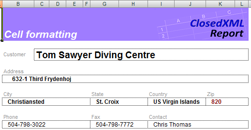
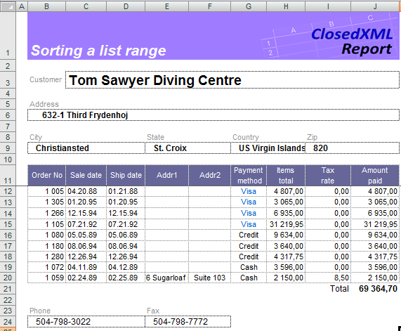
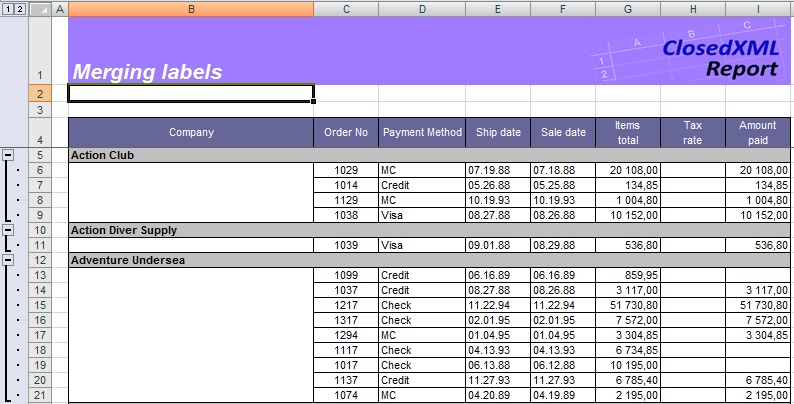
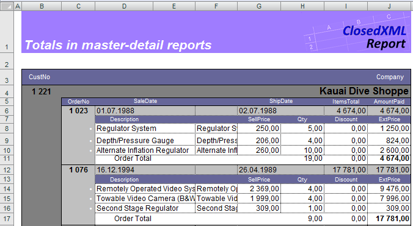
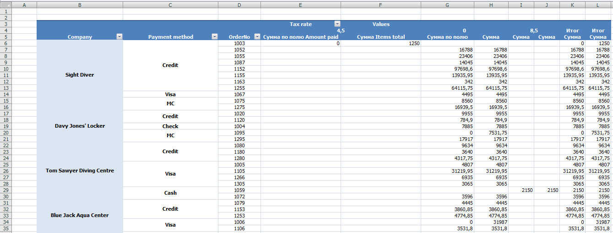

# Report examples

### Simple Template

You can apply to cells any formatting including conditional formats.

The template: [Simple.xlsx]({{ site.github.repository_url}}/blob/develop/tests/Templates/Simple.xlsx)

The result file: [Simple.xlsx]({{ site.github.repository_url}}/blob/develop/tests/Gauges/Simple.xlsx)

### Sorting the Collection

You can sort the collection by columns. Specify the tag `<<sort>>` in the options row of the corresponding columns. Add option `desc` to the tag if you wish the list to be sorted in the descending order (`<<sort desc>>`). 

For more details look to the [Sorting](Sorting)

The template: [tLists1_sort.xlsx]({{ site.github.repository_url}}/blob/develop/tests/Templates/tLists1_sort.xlsx)

The result file: [tLists1_sort.xlsx]({{ site.github.repository_url}}/blob/develop/tests/Gauges/tLists1_sort.xlsx)

### Totals

You can get the totals for the column in the ranges by specifying the tag in the options row of the corresponding column. In the example above we used tag `<<sum>>` in the column Amount paid.

For more details look to the [Totals in a Column](Totals-in-a-column).

The template: [tlists2_sum.xlsx]({{ site.github.repository_url}}/blob/develop/tests/Templates/tLists2_sum.xlsx)

The result file: [tlists2_sum.xlsx]({{ site.github.repository_url}}/blob/develop/tests/Gauges/tLists2_sum.xlsx)

### Range and Column Options

Besides specifying the data for the range ClosedXML.Report allows you to sort the data in the range, calculate totals, group values, etc. ClosedXML.Report performs these actions if it founds the range or column tags in the service row of the range.

For more details look to the [Flat Tables](Flat-tables)

In the example above example we applied auto filters, specified that columns must be resized to fit contents, replaced Excel formulas with the static text and protected the "Amount paid" against the modification. For this, we used tags  `<<AutoFilter>>`, `<<ColsFit>>`, `<<OnlyValues>>` and `<<Protected>>`.

The template: [tLists3_options.xlsx]({{ site.github.repository_url}}/blob/develop/tests/Templates/tLists3_options.xlsx)

The result file: [tLists3_options.xlsx]({{ site.github.repository_url}}/blob/develop/tests/Gauges/tLists3_options.xlsx)

### Complex Range

ClosedXML.Report can use multi-row templates for the table rows. You may apply any format you wish to the cells, merge them, use conditional formats, Excel formulas.

For more details look to the [Flat Tables](Flat-tables)

The template: [tLists4_complexRange.xlsx]({{ site.github.repository_url}}/blob/develop/tests/Templates/tLists4_complexRange.xlsx)

The result file: [tLists4_complexRange.xlsx]({{ site.github.repository_url}}/blob/develop/tests/Gauges/tLists4_complexRange.xlsx)

### Grouping

The `<<group>>` tag may be used along with any of the aggregating tags. Put the tag `<<group>>` into the service row of those columns which you wish to use for aggregation.

For more details look to the [Grouping](Grouping)

The template: [GroupTagTests_Simple.xlsx]({{ site.github.repository_url}}/blob/develop/tests/Templates/GroupTagTests_Simple.xlsx)

The result file: [GroupTagTests_Simple.xlsx]({{ site.github.repository_url}}/blob/develop/tests/Gauges/GroupTagTests_Simple.xlsx)

### Collapsed Groups

Use the parameter collapse of the group tag (`<<group collapse>>`) if you want to display only those rows that contain totals or captions of data sections.

For more details look to the [Grouping](Grouping)

The template: [GroupTagTests_Collapse.xlsx]({{ site.github.repository_url}}/blob/develop/tests/Templates/GroupTagTests_Collapse.xlsx)

The result file: [GroupTagTests_Collapse.xlsx]({{ site.github.repository_url}}/blob/develop/tests/Gauges/GroupTagTests_Collapse.xlsx)

### Summary Above the Data

ClosedXML.Report implements the tag `summaryabove` that put the summary row above the grouped rows.

For more details look to the [Grouping](Grouping)

The template: [GroupTagTests_SummaryAbove.xlsx]({{ site.github.repository_url}}/blob/develop/tests/Templates/GroupTagTests_SummaryAbove.xlsx)

The result file: [GroupTagTests_SummaryAbove.xlsx]({{ site.github.repository_url}}/blob/develop/tests/Gauges/GroupTagTests_SummaryAbove.xlsx)

### Merged Cells in Groups (option 1)

The `<<group>>` tag has options making it possible merge cells in the grouped column. To achieve this specify the parameter mergelabels in the group tag (`<<group mergelabels>>`).

For more details look to the [Grouping](Grouping)

The template: [GroupTagTests_MergeLabels.xlsx]({{ site.github.repository_url}}/blob/develop/tests/Templates/GroupTagTests_MergeLabels.xlsx)

The result file: [GroupTagTests_MergeLabels.xlsx]({{ site.github.repository_url}}/blob/develop/tests/Gauges/GroupTagTests_MergeLabels.xlsx)

### Merged Cells in Groups (option 2)

Tag `<<group>>` allows to group cells without adding the group title. This function may be enabled by using parameter MergeLabels=Merge2 in the group tag (`<<group MergeLabels=Merge2>>`). Cells containing the grouped data are merged and filled with the group caption.

For more details look to the [Grouping](Grouping)

The template: [GroupTagTests_MergeLabels2.xlsx]({{ site.github.repository_url}}/blob/develop/tests/Templates/GroupTagTests_MergeLabels2.xlsx)

The result file: [GroupTagTests_MergeLabels2.xlsx]({{ site.github.repository_url}}/blob/develop/tests/Gauges/GroupTagTests_MergeLabels2.xlsx)

### Nested Groups

Ranges may be nested with no limitation on the depth of nesting.

For more details look to the [Grouping](Grouping)

The template: [GroupTagTests_NestedGroups.xlsx]({{ site.github.repository_url}}/blob/develop/tests/Templates/GroupTagTests_NestedGroups.xlsx)

The result file: [GroupTagTests_NestedGroups.xlsx]({{ site.github.repository_url}}/blob/develop/tests/Gauges/GroupTagTests_NestedGroups.xlsx)

### Disable Groups Collapsing

Use the option disableoutline of the group tag (`<<group disableoutline>>`) to prevent them from collapsing. In the example above the range is grouped by both Company and Payment method columns. Collapsing of groups for the Payment method column is disabled.

For more details look to the [Grouping](Grouping)

The template: [GroupTagTests_DisableOutline.xlsx]({{ site.github.repository_url}}/blob/develop/tests/Templates/GroupTagTests_DisableOutline.xlsx)

The result file: [GroupTagTests_DisableOutline.xlsx]({{ site.github.repository_url}}/blob/develop/tests/Gauges/GroupTagTests_DisableOutline.xlsx)

### Specifying the Location of Group Captions

The `<<group>>` tag has a possibility to put the group caption in any column of the grouped range by using the parameter `PLACETOCOLUMN=n` where `n` defines the column number in the range. (starting from 1). Besides, ClosedXML.Report supports the `<<delete>>` tag that aims to specify columns to delete. In the example above the Company column is grouped with the option `mergelabels`. The group caption is placed to the second column (`PLACETOCOLUMN=2`). Finally, the Company column is removed.

For more details look to the [Grouping](Grouping)

The template: [GroupTagTests_PlaceToColumn.xlsx]({{ site.github.repository_url}}/blob/develop/tests/Templates/GroupTagTests_PlaceToColumn.xlsx)

The result file: [GroupTagTests_PlaceToColumn.xlsx]({{ site.github.repository_url}}/blob/develop/tests/Gauges/GroupTagTests_PlaceToColumn.xlsx)

### Formulas in Group Line

ClosedXML.Report saves the full text of cells in the service row, except tags. You can use this feature to specify Excel formulas in group captions. In the example above there is grouping by columns Company and Payment method. The Amount Paid column contains an Excel formula in the service row.

For more details look to the [Grouping](Grouping)

The template: [GroupTagTests_FormulasInGroupRow.xlsx]({{ site.github.repository_url}}/blob/develop/tests/Templates/GroupTagTests_FormulasInGroupRow.xlsx)

The result file: [GroupTagTests_FormulasInGroupRow.xlsx]({{ site.github.repository_url}}/blob/develop/tests/Gauges/GroupTagTests_FormulasInGroupRow.xlsx)

### Groups with Captions

You can configure the appearance of the group caption by using the `WITHHEADER` parameter of the `<<group>>` tag. With this, the group caption is placed over the grouped rows. The `SUMMARYABOVE` does not change this behavior.

For more details look to the [Grouping](Grouping)

The template: [GroupTagTests_WithHeader.xlsx]({{ site.github.repository_url}}/blob/develop/tests/Templates/GroupTagTests_WithHeader.xlsx)

The result file: [GroupTagTests_WithHeader.xlsx]({{ site.github.repository_url}}/blob/develop/tests/Gauges/GroupTagTests_WithHeader.xlsx)

### Nested Ranges

You can place one ranges inside the others in order to reflect the parent-child relation between entities. In the example above the `Items` range is nested into the `Orders` range which, in turn, is nested to the `Customers` range. Each of three ranges has its own header, and all have the same left and right boundary.

For more details look to the [Nested ranges: Master-detail reports](Nested-ranges_-Master-detail-reports).

The template: [Subranges_Simple_tMD1.xlsx]({{ site.github.repository_url}}/blob/develop/tests/Templates/Subranges_Simple_tMD1.xlsx)

The result file: [Subranges_Simple_tMD1.xlsx]({{ site.github.repository_url}}/blob/develop/tests/Gauges/Subranges_Simple_tMD1.xlsx)

### Nested Ranges with Subtotals

You may use aggregation tags at any level of your master-detail report. In the example above the `<<sum>>` tag in the I9 cell will summarize columns `{{item.Discount}}` in the scope of an order, while the same tag in the I10 cell will summarize all the data for each Customer.

For more details look to the [Nested ranges: Master-detail reports](Nested-ranges_-Master-detail-reports).

The template: [Subranges_WithSubtotals_tMD2.xlsx]({{ site.github.repository_url}}/blob/develop/tests/Templates/Subranges_WithSubtotals_tMD2.xlsx)

The result file: [Subranges_WithSubtotals_tMD2.xlsx]({{ site.github.repository_url}}/blob/develop/tests/Gauges/Subranges_WithSubtotals_tMD2.xlsx)

### Nested Ranges with Sorting

You can use the `<<sort>>` for the nested ranges as well.

For more details look to the [Nested ranges: Master-detail reports](Nested-ranges_-Master-detail-reports).

The template: [Subranges_WithSort_tMD3.xlsx]({{ site.github.repository_url}}/blob/develop/tests/Templates/Subranges_WithSort_tMD3.xlsx)

The result file: [Subranges_WithSort_tMD3.xlsx]({{ site.github.repository_url}}/blob/develop/tests/Gauges/Subranges_WithSort_tMD3.xlsx)

### Pivot Tables

ClosedXML.Report support such a powerful tool for data analysis as pivot tables. You can define one or many pivot tables directly in the report template to benefit the power of the Excel pivot table constructor and nearly all the available features for they configuring and designing.

For more details look to the [Pivot Tables](Pivot-tables).

The template: [tPivot5_Static.xlsx]({{ site.github.repository_url}}/blob/develop/tests/Templates/tPivot5_Static.xlsx)

The result file: [tPivot5_Static.xlsx]({{ site.github.repository_url}}/blob/develop/tests/Gauges/tPivot5_Static.xlsx)
