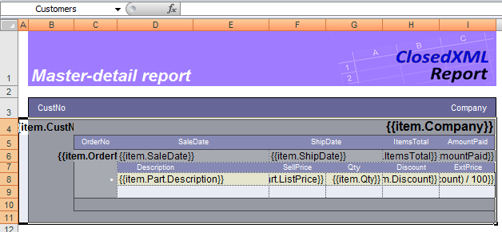
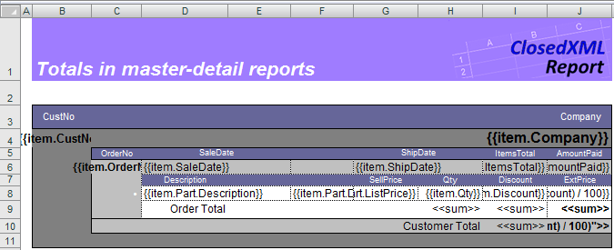

# Nested Ranges: Master-detail Report

ClosedXML.Report makes possible creating reports with a comprehensive structure. This can be achieved by placing one range inside the other which corresponds to "one-to-many" relation between two sets of data.

Consider the example. We want to desing a report in such a way that table `Items` were nested into table `Orders`, which in its turn would be nested in `Customer` table. Given that, and because the main information belongs to the table `Items` let's get started from it. On the picture you see the table `Items` definition.

As you can see, we named the range Customers_Orders_Items. Rules for assigning names to the ranges were explained in the section "[Flat tables#Range names](Flat-tables#Range%20names)". You also can see that we put a title above the table and left some place to the left of it, but that's just the matter of appearance, you don't have to do it if it's not what need.

Then, the range `Customers_Orders_Items` must be placed inside the range `Customers_Orders`.

We inserted an empty string before the range, put a couple of _expressions_ here, and defined a new named range covering entire range `Customers_Orders_Items`, plus the row with captions for this table, plus the row below the table, assuming this row to be a service row for our new range. We also added another row to hold captions for `Orders` table ("Order no", "Sale date", etc.)

Finally, we started to build `Customers` table.

This time we did the very same steps: insert the row, define the _expressions_ (`{{CustNo}}` and `{{Company}}`), apply styles we like and define a named range `Customers` covering the nested ranges, plus a service row.

You can download the template file from [the GitHub]({{ site.github.repository_url }}/blob/develop/tests/Templates/Subranges_Simple_tMD1.xlsx)

To conclude, the rules to follow when creating a report with nested ranges are these:

* All nested areas must be continuous. 
* Each range must have its own service row.
* All ranges must have the same left and right boundaries; thus their widths must be equal too.
* The leftmost column of all ranges is a "service" one.
* One range may have any number of nested ranges.
* The maximum depth of nested ranges is only limited by a worksheet capacity, when the data is specified.
* The nested range may be places between any two rows of the outer range.
* Each range in the hierarchy is treated as a whole, excluding the nested ranges, as described in the previous chapters.

## Subtotals in Master-Detail Reports

ClosedXML.Report supports calculating subtotals  for columns in a range. Here we use tag `<<sum>>` in both ranges `Customers_Orders_Items` and `Customers_Orders`.

The resulting template may be found on [the GitHub]({{ site.github.repository_url }}/blob/develop/tests/Templates/Subranges_WithSubtotals_tMD2.xlsx)
