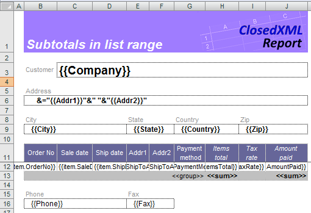

# Quick Start

ClosedXML.Report is a tool for report generation and data analysis in .NET applications through the use of Microsoft Excel.

It is a .NET-library for report generation Microsoft Excel without requiring Excel to be installed on the machine that's running the code. With ClosedXML.Report, you can easily export any data from your .NET classes to Excel using the XLSX-template.

Excel is an excellent alternative to common report generators, and using Excel’s built-in features
can make your reports much more responsive.
Use ClosedXML.Report as a tool for generating files of Excel. Then use Excel visual instruments: formatting (including
conditional formatting), AutoFilter, Pivot tables to construct a versatile data analysis system. With ClosedXML.Report, you can move a lot of report programming
and tuning into Excel. ClosedXML.Report templates are simple and our algorithms are fast – we carefully count every
millisecond – so you waste less time on routine report programming and get surprisingly fast results. If you want
to master such a versatile tool as Excel – ClosedXML.Report is an excellent choice.
Furthermore, ClosedXML.Report doesn’t operate with the usual concepts of band-oriented report tools: Footer, Header,
and Detail. So you get a much greater degree of freedom in report construction and design, and the easiest possible integration of .NET and Microsoft Excel. 

### Install ClosedXML.Report via NuGet

If you want to include ClosedXML.Report in your project, you can [install it directly from NuGet](https://www.nuget.org/packages/ClosedXML.Report/)

To install ClosedXML.Report, run the following command in the Package Manager Console

```
PM> Install-Package ClosedXML.Report
```
or if you have a signed assembly, then use:
```
PM> Install-Package ClosedXML.Report.Signed
```

## Features

* Copying cell formatting
* Propagation conditional formatting
* Vertical and horizontal tables and subranges
* Ability to implement Excel formulas
* Using dynamically calculated formulas with the syntax of C # and Linq
* Operations with tabular data: sorting, grouping, total functions.
* Pivot tables
* Subranges

## How to use?
To create a report you must first create a report template. You can apply any formatting to any workbook cells, insert pictures, and modify any of the parameters of the workbook itself. In this example, we have turned off the zero values display and hidden the 
gridlines. ClosedXML.Report will preserve all changes to the template. 

**Template**



**Code**

```c#
    protected void Report()
    {
        const string outputFile = @".\Output\report.xlsx";
        var template = new XLTemplate(@".\Templates\report.xlsx");

        using (var db = new DbDemos())
        {
            var cust = db.customers.LoadWith(c => c.Orders).First();
            template.AddVariable(cust);
            template.Generate();
        }

        template.SaveAs(outputFile);

        //Show report
        Process.Start(new ProcessStartInfo(outputFile) { UseShellExecute = true });
    }
```

**Result**


For more information see [the documentation](index) and [tests]({{ site.github.repository_url}}/tree/master/tests)
