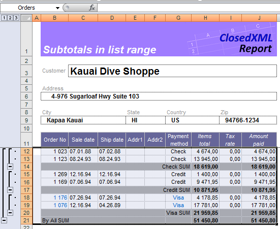

Переменные и их поля типа IEnumerable могут быть связаны с областью (плоская таблица). Для вывода всех значений IEnumerable необходимо выделить область и дать ему имя переменной. ClosedXML.Report находит именованные области и пытается выполнить отображение на связанные переменные. Для доступа к полям строк списка можно использовать имя item. 

При этом область имеет строгий формат:
* Область может быть только прямоугольной формы.
* Область должна быть непрерывной.
* Ячейки области могут содержать формулы полей, обычные формулы Excel экранированные с `&`.
* Ячейки могут быть пустыми.

### Именование областей
При построении документа ClosedXML.Report находит все именованные области и по их имени определяет источник данных. Имя области должно иметь имя переменной, из которой будут браться данные. Для вложенных таблиц имя области задаётся через подчёркивание '_'. Например, для списка Customers[].Orders[].Items[] имя области должно быть Customers_Orders_Items. Данный пример можно найти в [примере шаблона](https://github.com/ClosedXML/ClosedXML.Report/blob/develop/tests/Templates/Subranges_Simple_tMD1.xlsx).

## Вертикальные области
**Главное требование формата вертикальных областей ClosedXML.Report.** Любая горизонтальная область должна включать минимум два столбца и две строки. Крайний левый столбец и нижняя строка области рассматриваются как служебные и обрабатываются особым образом. После построения отчета все значения в ячейках служебного столбца очищаются, а служебная строка в зависимости от использованных опций уничтожается.

При работе с областями этого типа ClosedXML.Report придерживается четкой схемы:
* В область вставляется необходимое для переносимых записей количество строк. Обратите внимание, что при этом происходит вставка ячеек в область, а не строк в лист. Т.е. ячейки правее и левее области не будут опускаться вниз.
* На вставленные строки накладываются форматы шаблонных ячеек.
* Затем шаблонные ячейки удаляются.
* В случае если в служебных ячейках (нижняя служебная строка области) не описаны какие-либо дополнительные действия (опции) удаляется служебная строка.
* Если в служебной строке указаны дополнительные опции, то они обрабатываются, а затем в зависимости от набора указанных опций эта строка либо удаляется, либо в ней очищаются ячейки с опциями.

Возьмём для рассмотрения шаблон с [главной страницы](https://github.com/ClosedXML/ClosedXML.Report). На рисунке
показано, что область называется Orders и содержит только одну строку с формулами полей и служебные строку и
столбец.


Мы применили различное форматирование ячеек в области. В том числе, мы задали формат даты для ячеек с формулами полей SaleDate и ShipDate. Формат числа с разделителями мы указали для полей Items total и Amount paid. Задали условное форматирование для Payment method. 
Что бы из шаблона сгенерировать документ, нужно выполнить такой код:
```
...
        var template = new XLTemplate('template.xslx');
        var cust = db.Customers.GetById(10);

        template.AddVariable(cust);
        template.Generate();
...

public class Customer
{
    ...
    public List<order> Orders { get; set; }
}

public class order
{
	public int OrderNo { get; set; } 
	public DateTime? SaleDate { get; set; } // DateTime
	public DateTime? ShipDate { get; set; } // DateTime
	public string ShipToAddr1 { get; set; } // text(30)
	public string ShipToAddr2 { get; set; } // text(30)
	public string PaymentMethod { get; set; } // text(7)
	public double? ItemsTotal { get; set; } // Double
	public double? TaxRate { get; set; } // Double
	public double? AmountPaid { get; set; } // Double
}
```
На рисунке ниже вы видите полученный по этому шаблону готовый отчет. Обратите внимание на выделение области Orders в готовом отчете. Теперь эта область содержит перенесенные в отчет данные. В готовом отчете вы можете обращаться по имени области к этим данным.



## Горизонтальные области
Для горизонтальных областей нет таких строгих требований, как к вертикальным. При этом если область состоит только из одной строки (т.е. область не содержит строки опций), то она считается горизонтальной. Для горизонтальной области так же отсутствует требование иметь столбец опций. Т.е. горизонтальная область может состоять только из одной ячейки. Для строгого определения области как горизонтальной, в любой ячейке области должен быть определён тег Range с опцией horizontal: `<<Range horizontal>>`. Пример шаблона, использующего горизонтальные области можно найти в тестах тут [https://github.com/ClosedXML/ClosedXML.Report/blob/develop/tests/Templates/4.xlsx](https://github.com/ClosedXML/ClosedXML.Report/blob/develop/tests/Templates/4.xlsx).

В этом шаблоне мы можем найти две горизонтальных области, которые называются dates и PlanData_Hours. Каждая область состоит из одной ячейки. ClosedXML.Report такие области автоматически определяет как горизонтальные.


Сгенерированный документ:


## Служебная строка
ClosedXML.Report имеет ряд встроенных возможностей, которые позволяют сортировать полученную область, получать итоги по ее колонкам, группировать область и др. Эти дополнительные действия над областью можно вызвать, дополнив книгу-шаблон тэгами области или столбцов. Тэг – это строковое значение, заключённое в двойные угловые скобки и понятное анализатору ClosedXML.Report. Для табличных областей ClosedXML.Report все действия производит по указанию какого-либо тэга в служебной строке. В следующих разделах, мы подробно расскажем обо всех тэгах области. С помощью этих тэгов в служебной строке вы сможете указывать, какие действия необходимо произвести как над областью в целом (тэги области), так и над конкретным столбцом области (тэги столбца). Эти опции помогут вам получить промежуточные итоги, включить автофильтр, создать сводные таблицы по области и др.

Для примера рассмотрим следующий шаблон. 


В ячейке шаблона под формулой поля Amount paid вписана строка `<<sum>>`. Для этой ячейки мы указали числовой формат с разделителями и "полужирный" шрифт. В соседней слева ячейке мы написали “Итого”. Когда мы запустим отчет, то снизу на месте тэга `<<sum>>` появится сумма по столбцу Amount paid с форматированием ячейки-шаблона. Тэг `<<sum>>` относится к
тэгам столбцов. Такие тэги позволяют описать действия только над столбцом, под которым они указаны. Чаще всего вы
будете использовать тэги, создающие итоги по столбцу (или промежуточные итоги). Но с помощью тэгов столбцов вы
можете также произвести сортировку данных или сгруппировать данные.
Действия над областью в целом описывают тэги области. Они указываются в крайней левой ячейке служебной строки. Откройте этот же шаблон, впишите в эту ячейку тэг `<<Autofilter>>` и тэг `<<OnlyValues>>`, сохраните и закройте шаблон. В построенном по этому шаблону отчете вы увидите включенный для этой области автофильтр. Назначение тэга `<<Autofilter>>` после построения отчета вам, наверняка, уже понятно. Что же происходит в области после использования тэга `<<OnlyValues>>`? Этот тэг позволяет убрать из области все формулы, заменив их значениями, полученными в результате вычислений по этим формулам. Обратите внимание на сумму по столбцу “Amount paid”. Теперь в этой ячейке формула “=ПРОМЕЖУТОЧНЫЕ.ИТОГИ(9; ...” преобразована в результат этой формулы. 