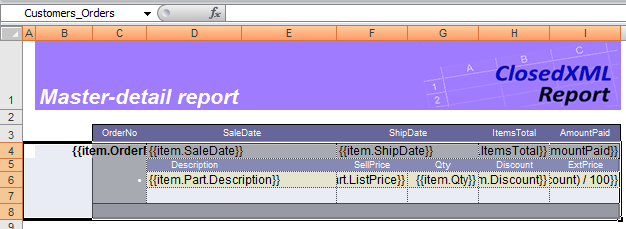

# Вложенные области: отчет с детализацией

ClosedXML.Report позволяет создавать сложно-структурированные отчеты. Это достигается размещением одной области внутри другой, что отражает отношение «один-ко-многим» между двумя наборами данных. 

Разберём пример. Мы должны спроектировать шаблон таким образом, чтобы область таблицы Items была вложена в область Orders, а та, в свою очередь, в область таблицы Customer. Исходя из этих соображений и из того факта, что основная информация содержится именно в этой таблице, мы начали с проектирования области Items. На рисунке вы видите то, что у нас получилось. 

Как вы видите, мы назвали область Customers_Orders_Items. Об именовании областей мы говорили в разделе [Flat tables#Именование областей](https://github.com/ClosedXML/ClosedXML.Report/wiki/Flat-tables#%D0%98%D0%BC%D0%B5%D0%BD%D0%BE%D0%B2%D0%B0%D0%BD%D0%B8%D0%B5-%D0%BE%D0%B1%D0%BB%D0%B0%D1%81%D1%82%D0%B5%D0%B9). 
Из рисунка также видно, что над областью мы поместили заголовок таблицы и оставили несколько ячеек слева пустыми. Последнее мы сделали только из-за желания сделать привлекательным и легко читаемым будущий отчет. Вы же можете не делать этого. Спроектированная область Customers_Orders_Items должна быть вложена в область Customers_Orders. 

Мы вставили пустую строку над заголовком таблицы, указали в ней несколько формул полей из таблицы Orders и выделили область, включающую все строки области Customers_Orders_Items, строку с заголовком этой области, и строку под ней, подразумевая, что нижняя строка области является служебной. После мы добавили еще и заголовок над областью Customers_Orders. После этого мы приступили к формированию области для таблицы Customers.

Сильно не мудрствуя, мы вставили строку над заголовком области Customers_Orders и указали в ней формулы двух полей таблицы Customer (CustNo и Company). Памятуя о служебной строке области и о том, что необходимо этой последней областью охватить все предыдущие мы выделили область от строки с только что введенными формулами полей до строки, расположенной ниже области Customers_Orders. Эту выделенную область мы поименовали как Customers. Кроме того, из тех соображений, что пользователи благосклонно относятся только к красивым и легко читаемым отчетам, мы придали лоск будущему отчету, облагородив его различными цветами фона, границ и шрифтов. Из рисунка видно, что многие ячейки слева у вложенных областей оставлены пустыми. Повторим, что это сделано только из соображений дизайна. В своих отчетах вы можете не следовать этому примеру, памятуя только о том, что крайний левый столбец всегда считается служебным.

[Полученный шаблон](https://github.com/ClosedXML/ClosedXML.Report/blob/develop/tests/Templates/Subranges_Simple_tMD1.xlsx)

Все это мы проделали, следуя нескольким несложным правилам, которым должны подчиняться вложенные области. Вот они:
* все вложенные области должны соблюдать описанные выше правила непрерывности;
* все области должны иметь служебную строку;
* все области должны быть одной ширины и их левая и правая границы должны совпадать;
* крайний левый столбец всех областей является служебным;
* в область может быть вложено любое количество других областей;
* глубина вложенности областей и их размеры ограничиваются только размером листа с учетом размеров готового отчета;
* вложенная область может располагаться между любыми строками охватывающей ее области;
* каждая область в иерархии вложенности рассматривается как единой целое за вычетом всех вложенных в нее областей, которые были описаны в предыдущих главах.

## Подытоги в отчётах "один-ко-многим"
Здесь мы воспользуемся возможностями ClosedXML.Report по подведению итогов по столбцам области. Для демонстрации этих возможностей просуммируем поля в области Customers_Orders_Items и Customers_Orders, воспользовавшись тэгом итогов `<<sum>>`.

[Итоговый шаблон](https://github.com/ClosedXML/ClosedXML.Report/blob/develop/tests/Templates/Subranges_WithSubtotals_tMD2.xlsx)
